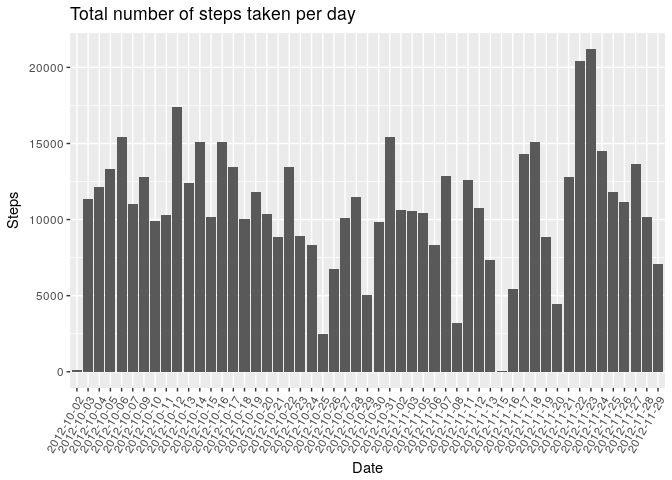
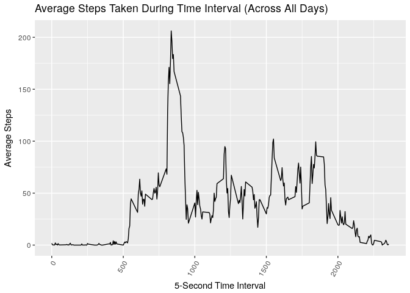
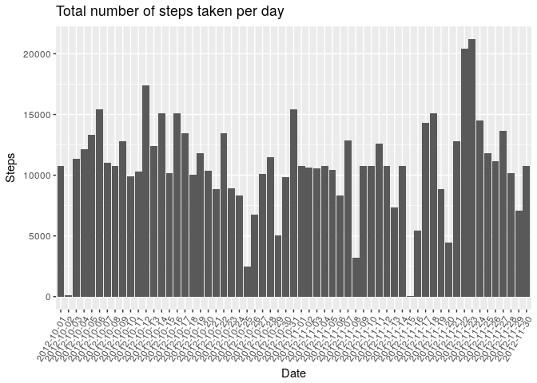
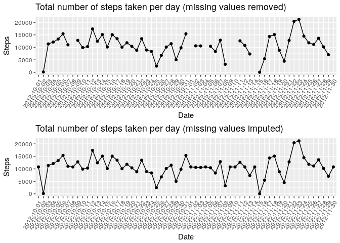
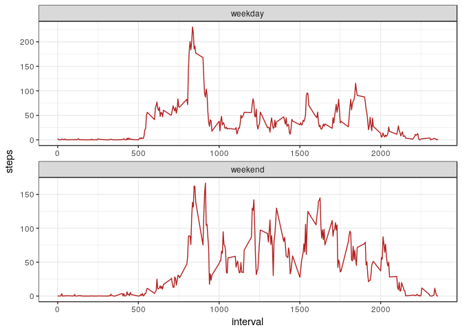

Project: Analysis of personal movement device
---------------------------------------------

#### Loading and preprocessing of the data

    #Check if file exists.  If it does not, download it and unzip it.
    if(!file.exists("repdata%2Fdata%2Factivity.zip")) {
      download.file("https://d396qusza40orc.cloudfront.net/repdata%2Fdata%2Factivity.zip","repdata%2Fdata%2Factivity.zip")
      unzip("repdata%2Fdata%2Factivity.zip")
    }

    #Load data into dataframe
    activityDS <- read.csv("activity.csv")

    #Aggregate (calculate) total number of steps per day
    aggdatatotal <- aggregate(steps ~ date, data = activityDS, FUN=sum,rm=TRUE)

#### What is the total number of steps taken per day?

#### Plot, Mean, and Median

#### Note: Missing values were ignored

    #Histogram of the total number of steps taken each day
    ggplot(data=aggdatatotal,aes(x=aggdatatotal$date,y=aggdatatotal$steps)) + geom_histogram(stat="identity") +
      theme(axis.text.x = element_text(angle = 60, hjust = 1)) +
      ggtitle("Total number of steps taken per day") + 
      xlab("Date") + 
      ylab("Steps")

    ## Warning: Ignoring unknown parameters: binwidth, bins, pad

    mean(aggdatatotal$steps)

    ## [1] 10767.19

    median(aggdatatotal$steps)

    ## [1] 10766

#### What is the daily activity pattern?

#### Average steps calculation and plot

#### Note: Missing values were ignored

    #Average number of steps taken across all 5-minute intervals
    aggdataavg <- aggregate(steps ~ interval, data = activityDS, FUN=mean,rm=TRUE)

    #Change column name to more accurate description
    names(aggdataavg)[2] <- paste("avgsteps")

    ggplot(data=aggdataavg,aes(x=aggdataavg$interval,y=aggdataavg$avgsteps)) + geom_line(stat="identity") +
      theme(axis.text.x = element_text(angle = 60, hjust = 1)) +
      ggtitle("Average Steps Taken During Time Interval (Across All Days)") + 
      xlab("5-Second Time Interval") + 
      ylab("Average Steps")

    #Which 5-minute interval, on average across all the days in the dataset, contains the maximum number of steps?
    aggdataavg[which.max(aggdataavg$avgsteps),]

    ##     interval avgsteps
    ## 104      835 206.1698

#### Imputing Missing Values

#### Calculate and report the total number of missing values in the dataset (i.e. the total number of rows with NAs)

    #Number of incomplete cases
    nrow(activityDS[!complete.cases(activityDS),])

    ## [1] 2304

#### Strategy for filling in missing values:

#### Using the mean of the five second interval across all days

    #Duplicate the original dataset and merge with interval averages
    activityDSFI <- merge(activityDS,aggdataavg,by="interval")

    #Fill in missing values with the average for the interval
    activityDSFI$steps[is.na(activityDSFI$steps)] <- activityDSFI$avgsteps[is.na(activityDSFI$steps)]

    #Remove the avgsteps column from dataset to arrive at final version of new dataset
    activityDSFI$avgsteps <- NULL

#### What is the total number of steps taken per day?

#### Plot, Mean, and Median

#### Note: Missing values were filled in

    #Aggregate (calculate) total number of steps per day
    aggdatatotal2 <- aggregate(steps ~ date, data = activityDSFI, FUN=sum,rm=TRUE)

    #Histogram of the total number of steps taken each day
    ggplot(data=aggdatatotal2,aes(x=aggdatatotal2$date,y=aggdatatotal2$steps)) + geom_histogram(stat="identity") +
      theme(axis.text.x = element_text(angle = 60, hjust = 1)) +
      ggtitle("Total number of steps taken per day") + 
      xlab("Date") + 
      ylab("Steps")

    ## Warning: Ignoring unknown parameters: binwidth, bins, pad

    mean(aggdatatotal2$steps)

    ## [1] 10767.19

    median(aggdatatotal2$steps)

    ## [1] 10767.19

#### Q: Do these values differ from the estimates from the first part of the assignment?

#### A: Based on my solution for imputing missing values, the means do not differ but the median's do differ.

#### Q: What is the impact of imputing missing data on the estimates of the total daily number of steps?

#### A: Based on the general trends observed, there appears to be minimal impact on the conclusions obtained.

#### The charts below are provided to give a sense of impact (or lack thereof) that the imputed values have on the dataset

    #Subset the filled in dataset before merging
    aggdatatotalMerged <- aggdatatotal

    #Merge steps data from two datasets for comparison
    aggdatatotalMerged <- merge(aggdatatotalMerged,aggdatatotal2,by="date",all=TRUE)

    #Change column name to more accurate description
    names(aggdatatotalMerged)[2] <- paste("steps")
    names(aggdatatotalMerged)[3] <- paste("stepsFilledIn")

    #Histogram of the total number of steps taken each day
    plot1 <- ggplot(data=aggdatatotalMerged,aes(x=date,y=steps,group=1)) +
      geom_line(na.rm=TRUE) + geom_point(na.rm=TRUE) +
      theme(axis.text.x = element_text(angle = 60, hjust = 1)) +
      ggtitle("Total number of steps taken per day (missing values removed)") + 
      xlab("Date") + 
      ylab("Steps")

    plot2 <- ggplot(data=aggdatatotalMerged,aes(x=date,y=stepsFilledIn,group=1)) + 
      geom_line() + geom_point() +
      theme(axis.text.x = element_text(angle = 60, hjust = 1)) +
      ggtitle("Total number of steps taken per day (missing values imputed)") + 
      xlab("Date") + 
      ylab("Steps")

    grid.arrange(plot1,plot2,ncol=1)

#### Are there differences in activity patterns between weekdays and weekends?

#### Make a panel plot containing a time series plot (i.e. type = "l") of the 5-minute interval (x-axis) and the average number of steps taken, averaged across all weekday days or weekend days (y-axis)

    #Create new column that computes the day of the week
    activityDSFI$dayType <- ifelse(weekdays(as.Date(activityDSFI$date),abbreviate=TRUE)=='Sat' |
                                   weekdays(as.Date(activityDSFI$date),abbreviate=TRUE)=='Sun','weekend','weekday')

    #Aggregate (calculate) total number of steps per weekend or weekday day
    aggdatatotal3 <- aggregate(list(steps=activityDSFI$steps),by=list(interval=activityDSFI$interval,dayType=activityDSFI$dayType),FUN=mean,rm=TRUE)

    ggplot(aggdatatotal3, aes(interval, steps))+geom_line(color="firebrick")+facet_wrap(~dayType,scales="free",nrow=2,ncol=1) +
      theme_bw()

